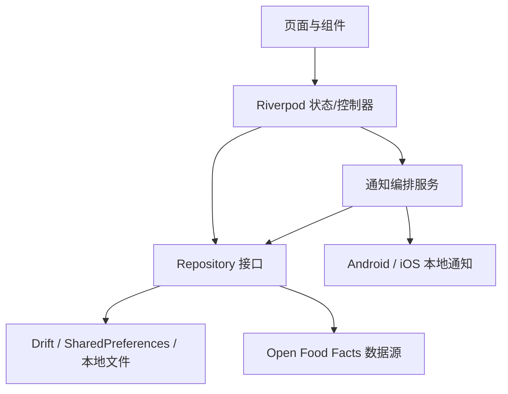

# 粮知 App 架构说明

> 文档状态：V0.1.0 实施基线
> 最后更新：2026-07-26
> 适用平台：Android、iOS
> 应用标识：`com.liangzhi.app`

## 1. 当前交付范围

V0.1.0 交付一个可持续扩展的本地优先食品库存应用，包含：

- 五个一级入口：首页、到期提醒、扫码添加、全部食物、我的；
- 手动添加食品；
- 一维商品条形码扫描；
- Open Food Facts 只读商品查询、本地缓存和手动补充回退；
- 食品列表、详情和本地持久化；
- 临期、今日到期、已过期汇总、长期未更新四类本地通知；
- 本地设置、清除本地数据、通用加载/空/错误/成功状态；
- Android 本地构建与验证，以及 Android/iOS CI 构建。

V0.1.0 不包含用户账号、云同步、家庭共享、二维码解析、图片识别、在线食谱、完整分类/位置管理、复杂搜索筛选、完整统计和正式埋点。

## 2. 技术与环境

- Flutter 3.41.6、Dart 3.11.4；后续升级必须独立验证并更新本文档。
- Riverpod 负责依赖注入和状态管理，不使用 Riverpod 代码生成。
- Drift/SQLite 负责业务数据和条码缓存；允许使用 Drift 与 `build_runner` 代码生成。
- `shared_preferences` 只保存轻量设置，不保存食品业务数据。
- `go_router` 负责声明式路由和五项底部导航状态保持。
- `mobile_scanner` 负责一维条形码扫描；通过格式白名单只启用 EAN-8、EAN-13、UPC-A、UPC-E 和 Code 128。
- `package:http` 负责 Open Food Facts 只读查询，业务层注入 `Client` 以便替换服务和自动化测试。
- `flutter_local_notifications` 配合 `timezone` 负责 Android/iOS 本地定时通知；基础版不申请精确闹钟权限。
- 测试代码可注入时间源；需要统一时间抽象时使用 `clock`，不得在业务规则中散落直接读取系统时间的逻辑。
- 通过 `--dart-define=APP_ENV=development|test|production` 区分环境，不建立原生 Flavor，不改变包标识。
- Open Food Facts 基地址通过 `--dart-define` 注入；生产默认使用固定版本的 HTTPS API。

## 3. 分层与依赖方向

目录职责：

- `lib/app/`：启动入口、环境、路由、主题和应用壳；
- `lib/core/`：数据库、网络、设置、通知、文件存储、错误类型；
- `lib/features/`：`home`、`expirations`、`scan`、`foods`、`add_food`、`food_detail`、`mine`；
- `lib/shared/`：跨功能领域模型、设计令牌和通用状态组件。

依赖规则：

- 页面只能通过 Provider/控制器访问业务能力；
- 状态层依赖 Repository 接口和通知编排接口；
- Repository 实现可以依赖数据库、网络和文件存储；
- 数据库、网络与平台服务不得依赖页面；
- 功能模块不得导入其他功能模块的内部实现；
- UI、Provider 和 Repository 不得暴露 Drift 生成类型或第三方 API 原始对象。

## 4. 路由与导航

五个一级分支保持各自导航栈和滚动状态：

| 入口 | 路径 | 说明 |
| --- | --- | --- |
| 首页 | `/home` | 概览、临期摘要、快速添加 |
| 到期提醒 | `/expirations` | 临期、今日到期和已过期分组 |
| 扫码添加 | `/scan` | 相机扫描、远程查询、手动补充 |
| 全部食物 | `/foods` | 默认列表视图和食品详情入口 |
| 我的 | `/mine` | 通知设置、隐私、版本和清除数据 |

子路由：

- `/foods/:foodId`：食品详情；
- `/add`：手动添加，可由首页、扫码未命中和全部食物进入。

非法路径进入统一路由错误页；格式正确但食品不存在时显示“食品不存在”业务状态。通知点击统一打开 `/expirations`。

## 5. UI 设计基线

`memory_bank/ui/` 是视觉与交互风格来源，PRD 和本架构文档决定功能范围。原型中的静态数据、五项导航未完成状态和关联食谱不代表 V0.1.0 业务范围。

设计规范：

- 目的：让家庭库存、到期风险和扫码录入在小屏幕上快速可读、可操作；
- 美学方向：有机自然，克制、温和、具有生活秩序感；
- 主色：绿色 `#3F854C`，深绿色 `#2F6E3C`，柔和绿色 `#EDF5EE`；
- 背景：白色 `#FFFFFF`，暖灰 `#F7F6F2`；
- 状态色：红色 `#F02D23` 仅用于必要错误/过期提示，临期使用琥珀色 `#FFB547`；
- 文本：主文本 `#191B18`，次级文本 `#777B75`，分隔线 `#E8E9E5`；
- 字体：沿用原型的中文平台字体策略，iOS 优先 PingFang SC，Android 使用系统可用的中文无衬线字体；这是对通用 UI 规则的品牌原型覆盖；
- 图标：统一使用 Material 线性图标，不使用 Emoji 充当功能图标；
- 所有触控区域不小于 48×48 逻辑像素；
- 200% 文本缩放下关键内容和操作仍可访问；
- 库存默认使用列表视图，不预置虚假食品数据；
- Logo、应用图标和启动页使用原创“粮知”视觉，不沿用默认 Flutter 图标。

## 6. 食品与日期规则

### 6.1 表单规则

- 名称必填，去除首尾空格后长度为 1—100 个字符；
- 数量必填且大于 0，最多保留 3 位小数，默认值为 `1`；
- 单位必填，默认“份”；
- 分类与存放位置默认选择系统项“其他”；
- 保存时必须获得到期日期，支持两种输入方式：
  - 直接选择到期日期；
  - 输入生产日期和保质期，保质期单位支持天、月、年，计算出到期日期；
- 不支持“无明确保质期”，也不使用购买日期作为保质期起算日；
- 直接选择过去日期允许保存，但必须给出非阻断提示。

### 6.2 日期计算

- `expiry_date` 是无时区的本地日历日期，格式固定为 `YYYY-MM-DD`；
- 天按日历日相加；月和年按日历规则相加，目标月份没有同日时取该月最后一天；
- 剩余天数按设备当前本地日期计算；
- `expiry_date < today` 为已过期，等于 `today` 为今日到期；
- 生产日期加保质期模式按保质期长度确定临期阈值；直接到期日期模式按创建日到到期日的日历天数确定：不足 7 天提前 1 天、7—30 天提前 3 天、超过 30 天提前 7 天；
- 单品 `reminder_days_before` 非空时覆盖默认阈值。

## 7. 完整数据库 Schema

数据库初始版本为 `1`。所有时间戳均保存 UTC Unix 毫秒；所有日期字段均保存 `YYYY-MM-DD`。

### 7.1 `categories`

| 字段 | SQLite 类型 | 约束 |
| --- | --- | --- |
| `id` | TEXT | PRIMARY KEY，用户分类使用 UUID，系统分类使用稳定系统 ID |
| `name` | TEXT | NOT NULL，去空格后 1—50 字符 |
| `sort_order` | INTEGER | NOT NULL，默认 0 |
| `is_system` | INTEGER | NOT NULL，0/1 |
| `created_at` | INTEGER | NOT NULL |
| `updated_at` | INTEGER | NOT NULL |
| `deleted_at` | INTEGER | NULL |

索引与约束：

- 活跃分类名称在应用层保持唯一；
- 系统分类不可删除；
- 系统默认分类按 PRD 写入，其中必须存在稳定 ID `category_other` 的“其他”；
- 查询只返回 `deleted_at IS NULL` 的记录，并按 `sort_order, created_at` 排序。

### 7.2 `locations`

| 字段 | SQLite 类型 | 约束 |
| --- | --- | --- |
| `id` | TEXT | PRIMARY KEY，UUID 或稳定系统 ID |
| `name` | TEXT | NOT NULL，去空格后 1—50 字符 |
| `sort_order` | INTEGER | NOT NULL，默认 0 |
| `is_system` | INTEGER | NOT NULL，0/1 |
| `created_at` | INTEGER | NOT NULL |
| `updated_at` | INTEGER | NOT NULL |
| `deleted_at` | INTEGER | NULL |

索引与约束：

- 活跃位置名称在应用层保持唯一；
- 系统位置不可删除；
- 系统默认位置按 PRD 写入，其中必须存在稳定 ID `location_other` 的“其他”；
- 查询只返回 `deleted_at IS NULL` 的记录，并按 `sort_order, created_at` 排序。

### 7.3 `foods`

| 字段 | SQLite 类型 | 约束 |
| --- | --- | --- |
| `id` | TEXT | PRIMARY KEY，UUID |
| `barcode` | TEXT | NULL，规范化一维条形码，不唯一 |
| `name` | TEXT | NOT NULL，去空格后 1—100 字符 |
| `brand` | TEXT | NULL，扫码建议或用户确认后的品牌，最多 100 字符 |
| `specification` | TEXT | NULL，扫码建议或用户确认后的规格，最多 100 字符 |
| `image_local_path` | TEXT | NULL，仅保存应用目录内相对路径 |
| `image_remote_url` | TEXT | NULL，仅允许 HTTPS |
| `category_id` | TEXT | NULL，REFERENCES `categories(id)` ON DELETE SET NULL |
| `location_id` | TEXT | NULL，REFERENCES `locations(id)` ON DELETE SET NULL |
| `quantity` | REAL | NOT NULL，CHECK `quantity > 0` |
| `unit` | TEXT | NOT NULL，默认“份”，1—20 字符 |
| `expiry_input_type` | TEXT | NOT NULL，`direct`/`production_shelf_life` |
| `production_date` | TEXT | NULL，`YYYY-MM-DD` |
| `shelf_life_value` | INTEGER | NULL，CHECK 大于 0 |
| `shelf_life_unit` | TEXT | NULL，`day`/`month`/`year` |
| `expiry_date` | TEXT | NOT NULL，`YYYY-MM-DD` |
| `reminder_days_before` | INTEGER | NULL，CHECK 大于等于 0 |
| `status` | TEXT | NOT NULL，`active`/`consumed`/`discarded` |
| `created_at` | INTEGER | NOT NULL |
| `updated_at` | INTEGER | NOT NULL |
| `deleted_at` | INTEGER | NULL |

一致性规则：

- `direct` 模式下 `expiry_date` 必填，保质期组合字段为空；
- `production_shelf_life` 模式下生产日期、保质期数值、单位和计算后的到期日期全部必填；
- 数量在写入前规范化为最多 3 位小数；
- 扫码命中的品牌和规格只在用户确认后写入食品记录，远程缓存变化不得覆盖已有食品；
- 有效库存定义为 `status = 'active' AND deleted_at IS NULL`；
- 吃完和丢弃更新 `status`，用户删除写入 `deleted_at`；
- 同一条码可以对应多个批次食品，因此 `barcode` 不唯一。

索引：

- `idx_foods_active_expiry(status, deleted_at, expiry_date)`；
- `idx_foods_updated_at(updated_at)`；
- `idx_foods_category_id(category_id)`；
- `idx_foods_location_id(location_id)`；
- `idx_foods_barcode(barcode)`。

### 7.4 `barcode_product_cache`

| 字段 | SQLite 类型 | 约束 |
| --- | --- | --- |
| `barcode` | TEXT | PRIMARY KEY，规范化条形码 |
| `lookup_status` | TEXT | NOT NULL，`found`/`not_found` |
| `product_name` | TEXT | NULL |
| `brand` | TEXT | NULL |
| `quantity_text` | TEXT | NULL |
| `image_url` | TEXT | NULL，仅允许 HTTPS |
| `category_tags_json` | TEXT | NULL，JSON 字符串数组 |
| `source` | TEXT | NOT NULL，固定 `open_food_facts` |
| `fetched_at` | INTEGER | NOT NULL |
| `expires_at` | INTEGER | NOT NULL |

缓存规则：

- 命中结果缓存 30 天，未命中结果缓存 24 小时；
- 过期缓存仅在有网络时刷新，刷新失败可展示旧值并标明需要确认；
- 不保存完整远程响应；
- 清除本地数据时删除全部缓存。

### 7.5 迁移规则

- 每次 Schema 变更必须提升数据库版本；
- 迁移必须在副本或内存数据库验证旧数据不丢失；
- 新增非空字段必须提供可解释的迁移默认值；
- 禁止通过删除数据库文件代替正式迁移。

## 8. 默认数据

默认分类：主食、肉禽、水产、蔬菜、水果、乳制品、饮料、零食、调味品、冷冻食品、其他。

默认位置：冰箱冷藏、冰箱冷冻、厨房橱柜、零食柜、储物间、其他。

远程分类到本地分类按稳定关键词映射：

- cereals、rice、pasta、bread → 主食；
- meats、poultry → 肉禽；
- seafood、fish → 水产；
- vegetables → 蔬菜；
- fruits → 水果；
- dairy → 乳制品；
- beverages → 饮料；
- snacks、sweets → 零食；
- condiments、sauces、spices → 调味品；
- frozen → 冷冻食品；
- 未匹配 → 其他。

远程分类只作为可编辑建议，用户保存前可以修改。

## 9. 条形码与远程查询

- 只识别商品一维条形码，不解析二维码；
- 支持 EAN-8、EAN-13、UPC-A、UPC-E、Code 128；
- 扫描结果先规范化并校验，再查本地缓存，最后请求 Open Food Facts；
- Open Food Facts 使用只读商品接口，参数固定包含 `cc=cn`、`lc=zh`、`tags_lc=zh` 和最小字段集合；
- User-Agent 使用 `LiangZhi/<version> (https://github.com/mouren35/liang_zhi)`；
- 远程数据只填充名称、品牌、规格、图片和分类建议；
- 生产日期、保质期和到期日期不得信任远程商品记录，必须由用户确认或输入；
- 无网络、超时、限流、服务错误或未命中时立即进入带条码的手动添加页；
- 扫描结果去抖，同一条码在处理完成前只发起一次查询；
- V0.1.0 不向 Open Food Facts 写入商品或上传图片；
- “我的”页面展示 Open Food Facts 数据来源和许可证说明。

## 10. 本地通知

通知类型：

1. 临期汇总；
2. 今日到期；
3. 已过期汇总；
4. 30 天未更新库存提醒。

规则：

- 默认每天本地时间 09:00 最多发送一条食品汇总通知；
- 同一天的临期、今日到期和已过期食品合并为一条；
- 首次成功添加食品后申请通知权限；拒绝后不重复强制弹出，只在“我的”中提供系统设置入口；
- 通知点击进入 `/expirations`；
- 用户可关闭通知、调整时间、覆盖提前天数、关闭已过期提醒、每日汇总或长期未更新提醒；
- 调度采用设备当前时区；时区变化、应用启动、食品增删改、设置变更和清除数据后重新计算；
- 滚动预排未来 30 天的每日汇总，避免超过 iOS 待处理通知数量限制；
- 使用非精确定时能力，不申请 Android 精确闹钟权限；
- 长期未更新基于所有食品的最大 `updated_at`；无食品时不发送；
- 清除本地数据时取消全部待处理通知。

## 11. 设置存储

SharedPreferences 键必须集中定义并带版本前缀：

| 键 | 类型 | 默认值 |
| --- | --- | --- |
| `v1.has_completed_initial_launch` | bool | `false` |
| `v1.food_list_view_mode` | string | `list` |
| `v1.reminders_enabled` | bool | `true` |
| `v1.reminder_time` | string | `09:00` |
| `v1.global_reminder_days_override` | int? | `null` |
| `v1.remind_expired` | bool | `true` |
| `v1.daily_summary_enabled` | bool | `true` |
| `v1.long_term_reminder_enabled` | bool | `true` |
| `v1.long_term_reminder_days` | int | `30` |

首次启动状态和列表视图偏好在 V0.1.0 只提供存储服务与测试，不显示无效设置入口。

## 12. 清除数据

清除操作必须二次确认，并按以下顺序执行：

1. 取消全部待处理通知；
2. 在数据库事务中删除食品、条码缓存、用户分类和用户位置；
3. 删除应用管理目录内的食品图片；
4. 清除 SharedPreferences；
5. 幂等地重新写入系统默认分类和位置；
6. 将首次启动状态恢复为 `false`；
7. 导航回首页并显示轻量成功提示。

任一步失败都必须返回可理解错误，不得静默报告成功。

## 13. 错误、隐私与安全

- 统一错误类别：数据不存在、校验失败、数据库不可用、网络不可用、远程未命中、远程限流、远程服务错误、权限拒绝、通知调度失败；
- UI 不展示 SQL、堆栈或第三方响应原文；
- 日志不记录完整备注、库存内容、绝对文件路径或远程完整响应；
- 食品库存、生产日期和到期日期不发送到远程服务；远程请求只包含扫描所得条码和本地化参数；
- 网络请求只允许 HTTPS，并设置连接/响应超时；
- 远程图片失败不阻断食品保存；
- Open Food Facts 数据和图片按其许可证要求注明来源；
- 正式发布前完成 Open Food Facts API 使用登记。

## 14. 测试与发布

自动化测试：

- 模型与日期计算单元测试；
- Drift Schema、迁移、Repository 和缓存测试；
- Provider/控制器状态测试；
- 关键页面组件测试；
- 条码命中、未命中、离线、超时和重复扫描测试；
- 通知权限、聚合、时间边界、重调度和清除测试；
- Android 最小端到端流程。

验收标准：

- 所有触控区域不小于 48×48 逻辑像素；
- 200% 文本缩放下关键页面可操作；
- 首页首次加载不超过 2 秒；
- 100 条食品在 Profile 模式下无持续掉帧或明显卡顿；
- `flutter analyze` 零问题，全部自动化测试通过；
- Android 在本地完成构建和设备/模拟器验证；
- GitHub Actions 在 Linux 执行分析、测试和 Android 构建，在 macOS 执行 `flutter build ios --no-codesign`；
- iOS 真机、签名和 TestFlight 由具备 Mac、设备和凭据的外部环境完成，无法完成时记录为外部阻塞项；
- 通过验收后创建标签 `v0.1.0`。
